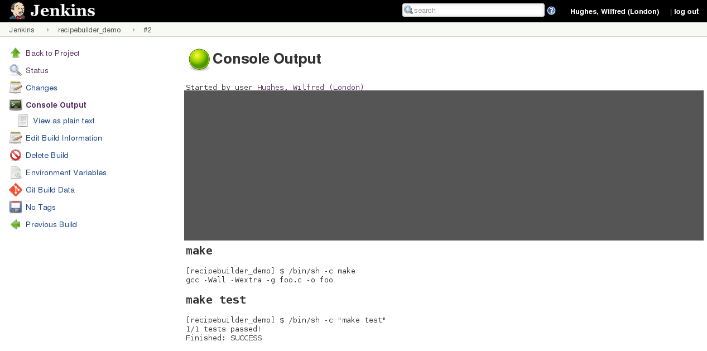

# Jenkins Blueprint
[](https://travis-ci.org/manahl/jenkins-blueprint-plugin)

Build Jenkins projects according to a `.jenkins.yml` file in the
repository. Inspired by Travis CI.

MIT license, see COPYING.

See also
[the workflow plugin](https://github.com/jenkinsci/workflow-plugin).

## Developing

You will need to generate a .hpi file.

```bash
# on our artifactory this may require running several times.
$ mvn package
```

Next, download jenkins.jar from http://jenkins-ci.org/ and run it:

```bash
$ java -jar jenkins.war
```

Copy your new plugin into your dev Jenkins instance:

```bash
$ cp target/blueprint.hpi ~/.jenkins/plugins/
```

## Installing

Visit the Plugin Manager in your Jenkins instance
(e.g. `http://example.com/pluginManager/advanced`) and upload the
`blueprint.hpi` file.

## Usage

Add a build step to your job 'Build according to .jenkins.yml'.

Then, check in a `.jenkins.yml` file with build instructions. For
example, for a C project, your file might look like this:

```yaml
script:
  - make
  - make test
```

For more elaborate build steps, use a multi-line YAML string:

```yaml
script:
  - |
    if [[ ! "$GIT_BRANCH" =~ "master" ]]; then
      echo "On a feature branch!"
    else
      echo "On master!"
    fi
```

When your build runs, you will end up with something like this:



## Known Limitations

Blueprint doesn't work with injecting environment variables.
